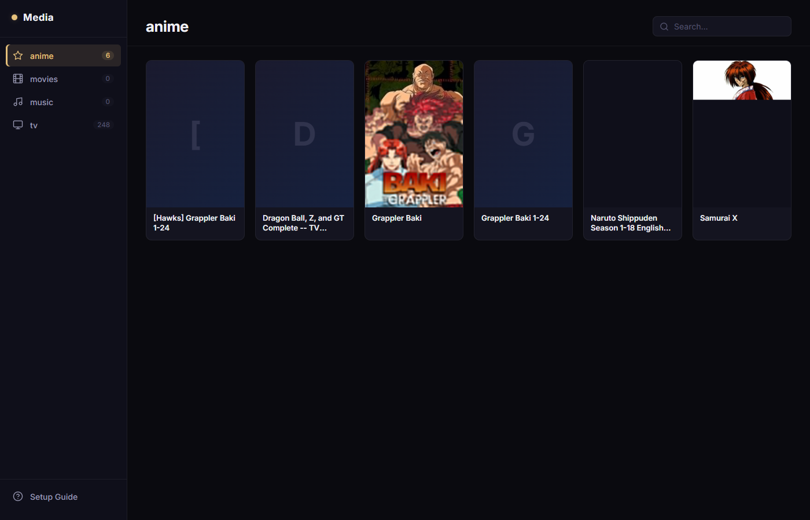

# OllieMedia

A self-hosted LAN media browser for your home network. Point it at your media folder, and browse movies, TV, anime, music, and podcasts from any device — phone, tablet, TV browser, or desktop. Runs as a single Docker container.



## Features

**Library**
- Auto-discovers categories from your top-level folder structure
- Reads local poster and backdrop art (`poster.jpg`, `backdrop.jpg`, `cover.jpg`)
- Reads Kodi-format `.nfo` files for title, year, runtime, genres, and plot
- Rescan without restarting the container

**Views** — switch between six layouts per category:
| View | Description |
|---|---|
| Recently Added | Hero cards showing the last 5 items added across all categories |
| Spotlight | Poster grid — hover spotlights one card and dims the rest |
| Flip | Poster grid — hover flips the card to reveal plot and metadata |
| Shelf | Netflix-style horizontal rows grouped by genre |
| Row | Comfortable list with poster thumbnail and synopsis |
| List | Ultra-compact single-line rows |

**Playback**
- **Play** button — streams directly to VLC via M3U playlist
- **Download** button — saves the file to your device
- Inline HTML5 audio player for music and podcasts

**UX**
- **Tile zoom** — `−` / `+` buttons in the header scale card sizes across all views (5 levels, persists across sessions)
- **Shelf nav arrows** — click `‹` / `›` on any shelf row to page through without using the scrollbar
- Sort by title, year, episode count, or date added (ascending or descending)
- Live search within each category
- Three themes: Dark, Light, Beagle
- Traefik-ready with labels out of the box

## Requirements

- Docker + Docker Compose on the host
- Media mounted at `/volume1/media/` (configurable via `MEDIA_ROOT`)
- VLC installed on client devices for the Play button

## Quick Start

```bash
git clone https://github.com/yizimoza/OllieMedia.git
cd OllieMedia
docker compose up --build -d
```

Open `http://YOUR-HOST-IP:3000` in a browser.

## Media Folder Structure

```
/volume1/media/
  Movies/
    Title (Year)/
      Title (Year).mkv
      poster.jpg          ← card art
      backdrop.jpg        ← detail modal background
      movie.nfo           ← Kodi XML metadata
  TV/
    Show Name/
      poster.jpg
      tvshow.nfo
      Season 01/
        Show - S01E01 - Title.mkv
  Anime/                  ← same structure as TV
  Music/
    Artist/
      Album (Year)/
        cover.jpg
        01 - Track.mp3
  Podcasts/
    Podcast Name/
      cover.jpg
      2024-01-15 - Episode Title.mp3
```

See the **Setup Guide** page in the app sidebar for the full NFO field reference.

## Configuration

| Variable | Default | Description |
|---|---|---|
| `MEDIA_ROOT` | `/volume1/media` | Path to your media library inside the container |
| `PORT` | `3000` | Port the server listens on |
| `SMB_PATH` | _(unset)_ | SMB root for the "Open Folder" button (e.g. `\\192.168.1.120\media`). When set, clicking Open Folder copies a UNC path Windows Explorer can navigate directly. |

## Rescan Library

After adding new media, trigger a fresh scan without restarting the container:

```bash
curl -X POST http://YOUR-HOST-IP:3000/api/rescan
```

## First-time Play button setup

The Play button generates a `.m3u` playlist that tells VLC to stream the file from the server. On first use your browser will ask what to open `.m3u` files with — select VLC and check "always use this app" so future clicks are seamless.
